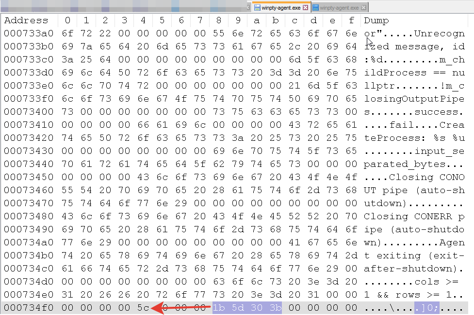
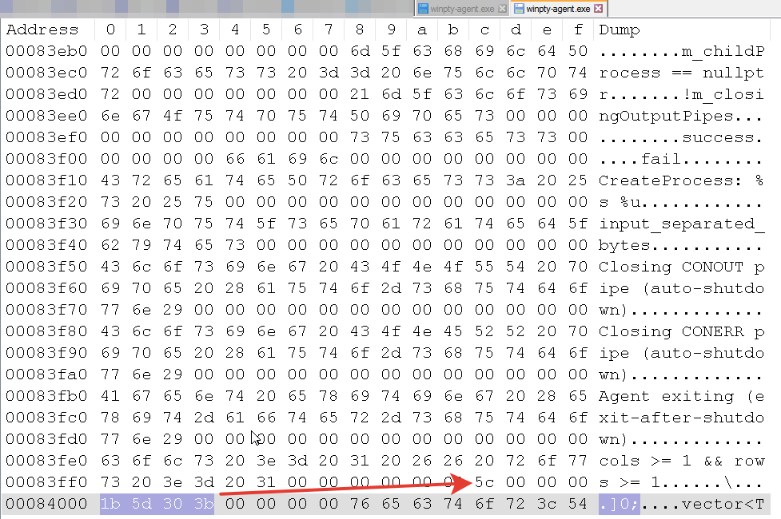

Есть консольные приложения которые не воспринимают заголовок окна как:
```
std::string("\x1b]0;") +utf8FromWide(newTitle) + "\x07";
```
но вполне воспринимают как:
```
std::string("\x1b]0;") +utf8FromWide(newTitle) + "\x5c";
```
Например такая беда с kytty_portable.exe
Если sshd использует winpty то при подключении к нему kytty_portable.exe заголовок окна уродуется
В этом компоненте используются бинарники  в winpty\ *.exe *.dll подписанные Микрософтом
поэтому в winpty5с\ я положил *.dll из https://github.com/rprichard/winpty в *.exe которых заменил \x07 на \x5c

